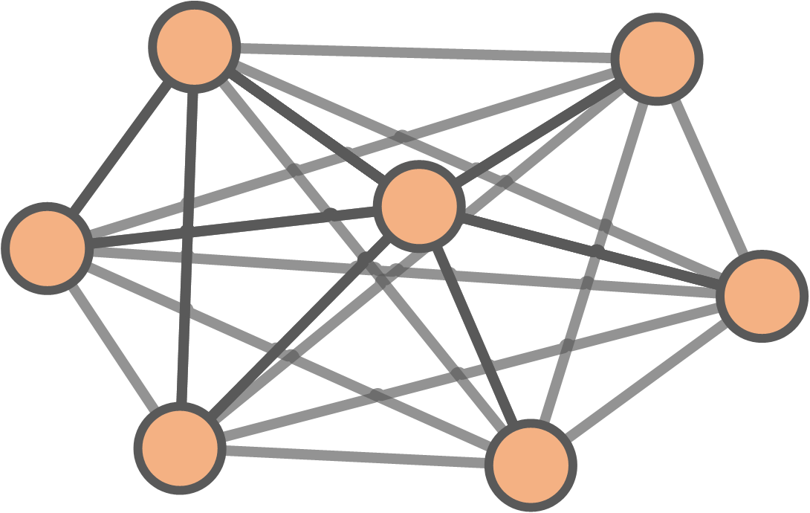
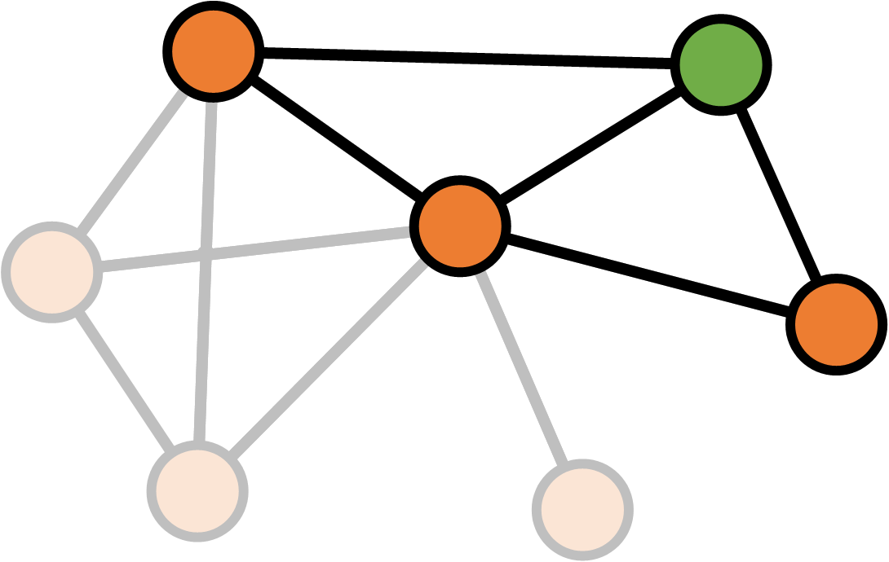

- title : Polyglot data science
- description : Polyglot data science with F#, R and D3.js
- author : Evelina Gabasova
- theme : white
- transition : none

***

# Polyglot data science
# 
 the force awakens 

## with F#, R and D3.js

- Evelina Gabasova **@evelgab**
- Tomas Petricek **@tomaspetricek**

********

# Part I
## F# with type providers

--------

...

---------

# Visualization with Google Charts

*********

# Part II
## Analyzing social networks with R

--------

# Social network analysis

* Who is the most central character?
* How to the movies compare between themselves?

-----
# Degree

-----
# Degree

-----
# Degree

------
# Degree

 

$$$
\text{Degree}(v) = \text{Number of links }v \leftrightarrow v' \\
v \neq v'

-----
# Betweenness

-----
# Betweenness

-----
# Betweenness

-----
# Betweenness

-----
# Betweenness

-----
# Betweenness

 

$$$
S_v = \text{Number of shortest paths between $a$ and $b$ through $v$} \\
S = \text{Number of shortest paths between $a$ and $b$} \\ \\
\text{Betweenness}(v)_{ab} = \frac{S_v}{S}

-----
# Betweenness

 

$$$
S_v = \text{Number of shortest paths between $a$ and $b$ through $v$} \\
S = \text{Number of shortest paths between $a$ and $b$} \\ \\
\text{Betweenness}(v) = \sum_{ab} \frac{S_v}{S}

-----
# Network structure

How do the the movies differ?

- Size
- Density
- Clustering coefficient

-----
- data-background : images/senate.jpeg

-----
# Density

-----
# Density

-----
# Density

 

$$$
\begin{align}
\text{Density} &= \frac{\text{Existing connections}}{\text{Potential connections}} \\
& \\
&= \frac{\text{Existing connections}}{\frac{1}{2}N(N-1)}
\end{align}

-----
# Clustering coefficient

-----
# Clustering coefficient

-----
# Clustering coefficient

-----
# Clustering coefficient

-----
# Clustering coefficient

-----
# Clustering coefficient

-----
# Clustering coefficient

 

$$$
K_v = \text{Number of neighbours of $v$} \\
E_v = \text{Number of links between neighbours of $v$} \\ \\
\text{Clustering}(v) = \frac{E_v}{\frac{1}{2} K_v (K_v - 1)}

-----
# Clustering coefficient

 

$$$
K_v = \text{Number of neighbours of $v$} \\
E_v = \text{Number of links between neighbours of $v$} \\ \\
\text{Clustering}(\text{network}) = \frac{1}{N} \sum_v \frac{E_v}{\frac{1}{2}  K_v (K_v - 1)}

-------

# The R language

- "domain-specific" language for statistical analysis

-----

# Very quick R intro

    [lang=R]
    # assignment
    x <- 1
    x = 1

    # variable names
    x
    x.y

-----

# Very quick R intro: pipeline
## |> turns into %>%

    [lang=R]
    install.packages("magrittr")
    library(magrittr)

    xs <- c(1,2,3,4,5,6,7,8,9,10)
    xs %>% mean

-----

# Network analysis with igraph

- [igraph website](http://igraph.org/r/)
- [igraph documentation](http://igraph.org/r/doc/)

    [lang=R]
    install.packages("igraph")
    library(igraph)

-----

# Calculating degree

    [lang=R]
    library(igraph)

    d <- degree(graph)

-----
- data-background : #212d30

# F#

    open RProvider.igraph

    let centrality = R.betweenness(network)

-----
# 
 Size 

-----
# 
 Density 

--------

# 
 Clustering coefficient 

********

# Part III
## Visualization with D3.js

--------

--------
# D3.js visualizations
## made easier

[Gallery of examples](https://github.com/mbostock/d3/wiki/Gallery)

--------

# D3.js social network visualization

[Force-directed network layout](http://bl.ocks.org/mbostock/4062045)

--------

- data-background : images/kyloapproves-loop3.gif
